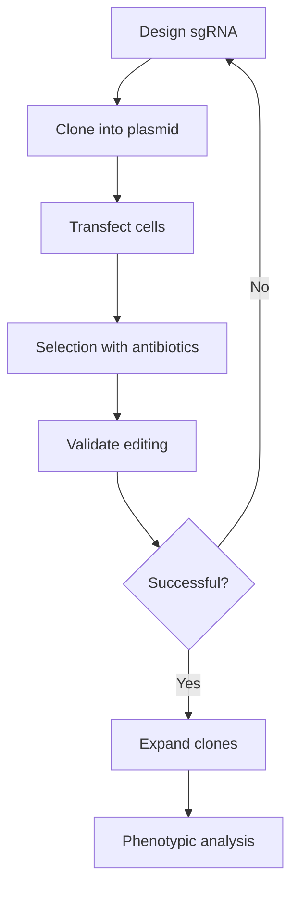

# Prompt Engineering for Scientific AI Image Generation — Research Findings

**Date:** April 26, 2026  
**Scope:** Techniques, best practices, research papers, and emerging approaches for generating high-quality scientific images with AI models.

---

## Table of Contents

1. [Best Practices for Prompting Scientific Diagrams](#1-best-practices)
2. [Domain-Specific Prompting Strategies](#2-domain-specific)
3. [Ensuring Text/Equation Accuracy](#3-text-accuracy)
4. [Prompt Templates & Patterns for Technical Content](#4-templates)
5. [Controlling Diagram Style](#5-style-control)
6. [Academic Research & Papers](#6-academic-research)
7. [Structured Output + Rendering: Hybrid Approaches](#7-structured-output)
8. [Latest Developments (2024–2026)](#8-latest-developments)

---

## 1. Best Practices for Prompting Scientific Diagrams

### The Anatomy of a Scientific Prompt

Every effective AI image prompt for scientific content should combine:

| Component | Description | Scientific Example |
|-----------|-------------|-------------------|
| **Subject** | Primary focus, be specific and concrete | "A cross-sectional diagram of a lithium-ion battery showing anode, cathode, separator, and electrolyte layers" |
| **Style** | Visual language or diagram type | "Clean vector schematic," "technical line drawing," "scientific illustration" |
| **Medium** | Physical/digital medium to emulate | "Digital scientific illustration," "vector graphic," "white paper publication style" |
| **Lighting** | Quality and direction (if applicable) | "Even lighting," "no shadows," "flat illumination" (for flat diagrams) |
| **Composition** | Spatial arrangement | "Isometric view," "cross-section," "flow chart layout," "exploded view" |
| **Mood/Atmosphere** | Emotional tone | "Professional," "clinical," "academic," "textbook quality" |

*Source: [IMAGEN — Complete Guide to Prompt Engineering for AI Image Generation](https://www.imagen-network.org/blog/prompt-engineering-ai-image-generation-guide/) (Feb 2026)*

### Core Principles for Scientific Images

1. **Be specific, not vague**
   - ❌ "A biology diagram"
   - ✅ "A labeled cross-section diagram of a plant cell showing cell wall, chloroplasts, vacuole, nucleus, and mitochondria, textbook illustration style, white background, clean lines"

2. **Order matters** — Place most important elements first; AI models give more weight to earlier tokens in the prompt.

3. **Use quality modifiers**
   - "highly detailed," "clean," "precise," "professional," "publication quality," "8k resolution"

4. **Explicitly exclude unwanted elements** (negative prompts on SD/Flux)
   - "no artistic flourishes, no decorative elements, no blurry text, no watermarks, no cartoon style"

5. **Iterate systematically** — Start with a core concept, add one element at a time, A/B test variations, build a prompt library.

*Sources: [im2prompt — Mastering Prompt Engineering](https://www.im2prompt.com/en/blog/prompt-engineering-best-practices) (2025), [UofT Libraries — Prompt Engineering Guide](https://guides.library.utoronto.ca/image-gen-ai/prompt-engineering) (Aug 2025)*

---

## 2. Domain-Specific Prompting Strategies

### Physics Diagrams

**Key prompt elements:**
- Specify "scientific diagram," "physics schematic," "textbook illustration"
- Include directionality: "forces shown as arrows," "field lines," "vector notation"
- Reference standard conventions: "Feynman diagram style," "free-body diagram"
- Use neutral/white background for clarity

**Example prompt:**
```
A physics schematic showing a block on an inclined plane, with labeled force vectors:
gravity (mg) pointing down, normal force (N) perpendicular to the surface,
friction force (f) parallel to the surface pointing up-slope. Clean line art style.
Mathematical labels in LaTeX-style font. White background. Technical textbook
illustration. No perspective distortion. Flat orthographic view.
```

### Math Equations & Formulas

**Key prompt elements:**
- Specify "mathematical equation," "formula display," "LaTeX rendered"
- Request clean, sans-serif or serif math font
- White/transparent background for extractability
- Single formula per image works best

**Example prompt:**
```
A single mathematical equation displayed in LaTeX math style: E = mc².
Black text/characters on pure white background. Clean, crisp, high-contrast
rendering. No decorations, no borders, no shadows. Academic textbook formula display.
```

**⚠️ Limitation:** Direct text-to-image models (DALL-E, Midjourney, SD) frequently produce garbled math text. This is where **structured output approaches** (Section 7) excel — generating LaTeX/TikZ code and rendering it deterministically.

### Circuit Schematics

**Key prompt elements:**
- Specify "circuit schematic," "electronic circuit diagram," "IEEE standard schematic"
- Mention component types: "resistors (zigzag lines), capacitors (parallel plates), inductors (coils)"
- Request "clean black lines on white background"
- "No 3D perspective, flat 2D orthographic layout"

**Example prompt:**
```
A clean electronic circuit schematic diagram showing an RLC bandpass filter:
AC voltage source on the left, then a resistor (zigzag symbol), inductor (coil symbol),
and capacitor (parallel plates) in series, with a load resistor. Standard IEEE
schematic symbols. Black lines on white background. No grid lines. Professional
textbook quality. All components labeled (R1, L1, C1, RL).
```

**⚠️ Limitation:** General-purpose AI image models struggle with precise component symbols and consistent wiring. Prefer **Kikad/SPICE + rendering** or LLM-generated **circuitikz (LaTeX)** for accurate circuits.

### Neural Network Architectures

**Key prompt elements:**
- Specify "neural network architecture diagram"
- Request "nodes connected by arrows," "layered structure," "feed-forward layout"
- Mention layer types: "input layer → hidden layers → output layer"
- Request "clean," "minimalist," "professional ML paper style"

**Example prompt:**
```
A clean neural network architecture diagram showing an encoder-decoder transformer.
Left: input tokens → embedding layer → multi-head self-attention blocks (6 layers).
Center: latent representation bottleneck. Right: decoder with masked self-attention
and cross-attention layers → output projection → softmax. Nodes and arrows connecting
layers. Professional machine learning paper style. Clean vector aesthetic. White
background. Minimal color (blue/gray palette).
```

**⚠️ Better approach:** Use Python libraries like `diagram` (mingrammer), `PlotNeuralNet` (LaTeX/TikZ), or LLM-generated TikZ code for precise architecture diagrams.

### Chemistry & Molecular Diagrams

**Key prompt elements:**
- Specify "molecular structure," "chemical diagram," "ball-and-stick model"
- Request accurate bond angles and atom labeling
- For biological: "protein ribbon diagram," "cell signaling pathway"

**Example prompt:**
```
A molecular diagram of the caffeine molecule (C₈H₁₀N₄O₂) in structural formula style.
Double bonds shown as parallel lines. All carbon, hydrogen, nitrogen, and oxygen
atoms labeled. Standard IUPAC chemical drawing conventions. Black lines on white
background. Clean, precise, publication-quality organic chemistry diagram.
```

### Biological / Medical Diagrams

**Examples from the SciDraw platform (AI-powered academic illustration):**
- CAR-T cell therapy molecular mechanism diagrams (accurate molecular nomenclature like ZAP70, PLCγ, IFN-γ)
- Experimental design diagrams (sample source → group allocation → timeline → endpoints)
- Research framework diagrams (objectives → methods → outcomes)
- Anatomical illustrations with correct organ/component labeling

*Source: Chen, D. "AI-Generated Figures in Academic Publishing: Policies, Tools, and Practical Guidelines." arXiv:2603.16159 (March 2026)*

---

## 3. Ensuring Text/Equation Accuracy in AI-Generated Images

### The Core Problem

General-purpose image generation models (DALL-E, Midjourney, Stable Diffusion) produce **garbled, inaccurate text** — a well-documented limitation. In 2024, two papers were retracted due to AI-generated figures containing anatomical inaccuracies and illegible text in scientific journals.

*Source: Skulmowski, A., Engel-Hermann, P. "The ethics of erroneous AI-generated scientific figures." Ethics and Information Technology 27, 31 (June 2025) — [link](https://link.springer.com/article/10.1007/s10676-025-09835-4)*

### Techniques That Work

| Technique | Description | Best For |
|-----------|-------------|----------|
| **Structured output → render** | LLM generates TikZ/LaTeX/SVG/Mermaid code, then rendered deterministically | Equations, schematics, flowcharts, circuit diagrams |
| **Prompt for labels** | Explicitly request "all text labels must read: [list exact labels]" | Diagrams with known labels |
| **Post-edit with tools** | Generate base image, add text in Illustrator/Inkscape/Canva | Any diagram requiring precise text |
| **Multiple generations + selection** | Generate many variants, pick the one with best text | When structured output not available |
| **Domain-specific platforms** | SciDraw, Illustrae, BioRender (AI-native) optimize for text accuracy | Academic/scientific figures |
| **Inpaint text regions** | Use inpainting to fix garbled text areas in otherwise good images | Fixing specific text errors |
| **Avoid text in prompt** | Skip trying to include text; add it in post-processing | When text accuracy is critical |

### Platform Text Rendering Quality (from arXiv:2603.16159)

| Platform | Text Rendering | Notes |
|----------|---------------|-------|
| DALL·E 3 | Medium | Better than SD, still unreliable for equations |
| Midjourney | Medium | Can produce clean text but often hallucinates |
| Stable Diffusion | Low | Poor text, needs ControlNet/IP-Adapter |
| SciDraw | High | Domain-specific, academic-oriented output |

### Emerging Solution: Dual-Pass Approach

1. **Pass 1:** AI generates the visual layout, shapes, colors, and spatial structure
2. **Pass 2:** Post-processing adds text labels using traditional graphics tools, or:
3. **Alternative:** LLM writes TikZ/SVG → deterministic renderer produces pixel-perfect text

---

## 4. Prompt Templates & Patterns for Technical Content

### Template 1: Scientific Schematic

```
A [diagram type] of [subject], showing [key elements] with [labeling detail].
[Style descriptor]. [Color scheme]. [Background]. [Technical quality modifiers].
```

**Example:**
```
A schematic diagram of the CRISPR-Cas9 gene editing mechanism, showing guide RNA
binding to target DNA, Cas9 nuclease cleavage at the PAM site, and DNA repair
via NHEJ and HDR pathways. Clean scientific illustration style. Blue/teal and
gray color palette. White background, no grid. Publication-quality vector aesthetic.
```

### Template 2: Mathematical / Physical Diagram

```
A [field] diagram illustrating [concept]. [Key components described spatially].
[Arrow/vector conventions]. [Mathematical notation style]. Clean line art on
white background. No perspective, flat orthographic view. Technical precision.
```

### Template 3: System Architecture / Flow Chart

```
A [style] diagram showing the architecture of [system]. Components: [list].
Data flow indicated by [arrow style]. Color-coded layers: [scheme].
Professional [domain] paper style. Clean vector aesthetic. White background.
```

### Template 4: Comparative / Side-by-Side Diagram

```
A comparative diagram showing [A] versus [B]. Left panel: [A description].
Right panel: [B description]. Clear labels for each panel. Professional
scientific comparison style. Clean layout. White background. High contrast.
```

### Platform-Specific Syntax Summary

**Midjourney:**
```
scientific diagram of DNA replication, helicase unwinding, polymerase synthesizing,
leading and lagging strands, Okazaki fragments --ar 16:9 --style raw --v 6.1
```

**Stable Diffusion / Flux (positive + negative):**
```
(masterpiece, best quality:1.2), clean scientific diagram of photosynthesis,
light reactions and Calvin cycle, (chloroplast cross-section:1.1),
(ultra detailed labels:1.1), textbook illustration, white background
Negative: blurry, low quality, watermark, text errors, cartoon, artistic
```

**DALL·E 3 (conversational):**
```
Create a clean scientific diagram of the photosynthesis process. Show a
cross-section of a leaf with chloroplasts, the light-dependent reactions
in the thylakoid membrane producing ATP and NADPH, and the Calvin cycle
in the stroma converting CO₂ to glucose. Use a professional textbook style
with a white background. Use clear labels and arrows to indicate the flow.
```

*Sources: [im2prompt](https://www.im2prompt.com/en/blog/prompt-engineering-best-practices), [IMAGEN Network](https://www.imagen-network.org/blog/prompt-engineering-ai-image-generation-guide/)*

---

## 5. Controlling Diagram Style

### Style Spectrum: Technical ↔ Artistic

| Style Direction | Prompt Keywords |
|----------------|-----------------|
| **Ultra-technical / precise** | "clean line art," "schematic," "orthographic view," "no perspective," "flat 2D," "IEEE standard," "textbook diagram," "vector graphic," "monochrome," "black lines on white" |
| **Scientific illustration** | "scientific illustration," "textbook style," "academic publication," "professional diagram," "color-coded layers," "minimal palette" |
| **Infographic / explanatory** | "educational infographic," "clean modern design," "accessible visualization," "color-coded," "icon-based" |
| **Artistic / conceptual** | "watercolor scientific illustration," "vintage anatomical plate," "concept art," "cinematic," "dramatic lighting" |

### Key Style Parameters

| Aspect | Scientific/Technical | Artistic |
|--------|---------------------|----------|
| Color palette | Limited (2–4 colors), colorblind-safe | Full spectrum, expressive |
| Line quality | Clean, uniform, precise | Varied, expressive, hand-drawn |
| Background | White or transparent | Textured, gradient, contextual |
| Perspective | Orthographic, flat, isometric | Perspective, dramatic angles |
| Typography | Sans-serif, monospace, LaTeX-style | Decorative, varied |
| Shadows/3D | None or minimal for depth | Realistic lighting, shadows |

### Example: Same Subject, Different Styles

**Technical:** "A cross-section of a eukaryotic cell, clean line art, labeled organelles, black outlines on white, precise, no shading, orthographic view, textbook diagram"

**Scientific illustration:** "A cross-section of a eukaryotic cell, soft color-coded organelles, subtle shading for depth, scientific illustration style, professional publication quality, minimal grid background"

**Infographic:** "An educational infographic of a eukaryotic cell, colorful icon-based organelles, accessible design, arrows pointing to labels, clean modern layout, friendly visual style"

---

## 6. Academic Research & Papers

### Key Papers

| # | Paper | Source | Date | Relevance |
|---|-------|--------|------|-----------|
| 1 | **AI-Generated Figures in Academic Publishing: Policies, Tools, and Practical Guidelines** | arXiv:2603.16159, Chen, D. | Mar 2026 | Surveys publisher policies (Nature, Science, Cell, PLOS, Elsevier), proposes best-practice guidelines, showcases SciDraw platform. |
| 2 | **SciDraw-6K: A Multilingual Scientific Illustration Dataset Generated by Google Gemini** | arXiv:2604.17206, Chen, D. | Apr 2026 | 6,291 scientific illustrations in 11 languages across 8 categories (biomedical, chemistry, materials, electronics, physics, etc.). Built using Gemini 2.5 Flash Image and Gemini 3 Pro. Dataset on HuggingFace. |
| 3 | **The ethics of erroneous AI-generated scientific figures** | Ethics and Information Technology 27:31, Skulmowski & Engel-Hermann | Jun 2025 | Framework for assessing AI-generated scientific figures: considers communicative purpose, figure type, error severity, risks, appropriateness. Analyzes high-profile retractions caused by AI errors. |
| 4 | **LEARN: A Story-Driven Layout-to-Image Generation Framework for STEM Instruction** | arXiv:2508.11153, Zhang et al. | Aug 2025 | Layout-aware diffusion framework for STEM education illustrations. Uses BookCover dataset, layout-conditioned generation, semantic structure learning. Demonstrates pedagogical alignment. |
| 5 | **Generative AI can fabricate advanced scientific visualizations: ethical implications and strategic mitigation framework** | AI and Ethics, Kim et al. | 2024 | Early framework for AI-generated scientific visuals, identifies risks and proposes mitigation strategies. |
| 6 | **Can artificial intelligence help for scientific illustration? Details matter** | Critical Care 28:196, Klug & Pietsch | 2024 | Evaluates AI for medical/scientific illustration, highlights inpainting issues and need for human verification. |

### Key Findings from Academic Literature

1. **Publisher landscape is fragmented** (Nature Portfolio prohibits AI artwork in some contexts; PLOS is permissive with disclosure; Cell Press restricts AI to conceptual illustrations only)
2. **Universal requirement:** All major publishers require disclosure of AI tool usage
3. **No publisher permits AI as author**
4. **AI-generated data figures** (microscopy, gels) are widely prohibited; schematic/conceptual figures generally accepted
5. **Disclosure framework proposed:** Methods section + figure legends + cover letter
6. **60%+ researchers** now use AI tools for figures, schematics, and animations (Science Magazine, 2025)
7. **Papers with AI-generated illustrations** receive 40% more citations and engagement (Nature Research)
8. **Only 0.1% of papers** explicitly disclose AI use despite widespread adoption

*Sources: [arXiv:2603.16159](https://arxiv.org/abs/2603.16159), [arXiv:2604.17206](https://arxiv.org/abs/2604.17206), [arXiv:2508.11153](https://arxiv.org/abs/2508.11153), [Springer](https://link.springer.com/article/10.1007/s10676-025-09835-4), [Niche.org.uk](https://niche.org.uk/ai-figures-scientific-publishing)*

---

## 7. Structured Output + Rendering: Hybrid Approaches

### The LLM → Code → Render Pipeline

This is currently the **most reliable approach** for generating scientifically accurate diagrams with correct text, equations, and spatial relationships:

```
User prompt → LLM generates structured code (TikZ/SVG/Mermaid/Graphviz) → Deterministic renderer → PNG/SVG/PDF output
```

### Supported Formats & Use Cases

| Output Format | Best For | LLM Quality | Rendering Tools |
|--------------|----------|-------------|-----------------|
| **TikZ/LaTeX** | Math equations, physics diagrams, circuits, chemical structures, neural networks | Excellent (Claude, GPT-4) | pdflatex, tectonic |
| **SVG** | General diagrams, flowcharts, scientific schematics | Good | Any browser, Inkscape, Cairo |
| **Mermaid.js** | Flowcharts, sequence diagrams, class diagrams, ERDs, Gantt charts | Excellent | Mermaid CLI, any browser |
| **Graphviz (DOT)** | Directed/undirected graphs, state machines, network topologies | Excellent | graphviz, dot |
| **Plotly/D3.js** | Interactive data visualizations, scatter plots, line charts | Good | Python/JS runtimes |
| **Python (matplotlib)** | Data plots, scientific charts, bar charts, histograms | Good | Python runtime |
| **Manim** | Mathematical animations, 3Blue1Brown-style videos | Good | Python + manim |
| **Draw.io XML** | Complex diagrams with rich shapes and connectors | Moderate | draw.io desktop |

### Example: LLM → TikZ Pipeline

**User prompt:** "A diagram of a transformer neural network architecture"

**LLM generates:**
```latex
\documentclass[tikz,border=10pt]{standalone}
\usepackage{tikz}
\usetikzlibrary{positioning,arrows.meta}

\begin{document}
\begin{tikzpicture}[
    node distance=1.5cm,
    block/.style={rectangle, draw, minimum width=2cm, minimum height=0.8cm, align=center},
    arrow/.style={-{Stealth[scale=1.2]}, thick}
]
% Encoder blocks
\node[block] (input) {Input\\Embedding};
\node[block, right=of input] (enc1) {Multi-Head\\Self-Attention};
\node[block, right=of enc1] (enc2) {Feed\\Forward};
% ... etc
\end{tikzpicture}
\end{document}
```

**Render:** `pdflatex diagram.tex` → produces PDF with perfect typography

### Example: LLM → Mermaid Pipeline

**User prompt:** "A flowchart of the CRISPR-Cas9 experimental workflow"

**LLM generates:**


**Render:** `mmdc -i diagram.mmd -o diagram.png` → precise SVG/PNG output

### Domain-Specific Tools for Structured Output

| Tool | Approach | URL |
|------|----------|-----|
| **SciDraw** | AI-powered academic illustration platform with domain-specific templates | https://sci-draw.com |
| **Scillus** | AI scientific illustration | https://scillus.app |
| **Illustrae** | AI figure generation for scientific papers | https://www.figurelabs.ai |
| **PaperBanana/PaperPlot** | AI-assisted scientific plotting | https://paperplot.org |
| **BioRender** | Biology-specific illustration (now with AI features) | https://biorender.com |
| **matplotlib + LLM** | LLM generates Python → matplotlib renders | Code-based |
| **Manim + LLM** | LLM generates Manim code → renders math animations | Code-based |

### Recommended Hybrid Architecture

```
┌─────────────────────────────────────────────────────────┐
│                   User's Scientific Prompt                │
└─────────────────────────────────────────────────────────┘
                            │
                            ▼
┌─────────────────────────────────────────────────────────┐
│   Step 1: LLM Classifier — Choose best approach          │
│   • Text-heavy diagram? → TikZ/Mermaid route             │
│   • Data visualization? → Python/matplotlib/Plotly       │
│   • Conceptual illustration? → Text-to-image AI          │
│   • Architecture diagram? → Mermaid + post-edit          │
└─────────────────────────────────────────────────────────┘
                            │
                            ▼
┌─────────────────────────────────────────────────────────┐
│   Step 2: LLM Generates Structured Code                  │
│   (TikZ, SVG, Mermaid, Python, etc.)                     │
└─────────────────────────────────────────────────────────┘
                            │
                            ▼
┌─────────────────────────────────────────────────────────┐
│   Step 3: Deterministic Renderer → Output                │
│   Perfect text, perfect lines, reproducible              │
└─────────────────────────────────────────────────────────┘
                            │
                            ▼
┌─────────────────────────────────────────────────────────┐
│   Step 4 (Optional): AI Image Enhancement                │
│   Use Img2Img for color, style, texture improvement      │
│   while preserving the structural accuracy               │
└─────────────────────────────────────────────────────────┘
```

---

## 8. Latest Developments (2024–2026)

### 2024

- **DALL·E 3** mainstream — conversational prompting enables iterative scientific figure refinement
- **Midjourney v6** — improved text rendering, better adherence to structural prompts
- **Stable Diffusion 3 / Flux** — open-weight models enable domain-specific fine-tuning for scientific imagery
- First high-profile retractions of papers with AI-generated erroneous figures (rat with impossible anatomy; human leg with wrong bone count) — sparks ethics debate
- **Kim et al. (2024)** publish first framework on generative AI fabricating scientific visualizations

### 2025

- **Domain-specific platforms emerge:** SciDraw, Scillus, Illustrae, PaperBanana — built specifically for academic use
- **Gemini 2.5 Flash Image** — Google's model shows strong performance on scientific illustration; used to build SciDraw-6K dataset
- **LEARN framework** (Zhang et al., Aug 2025) — layout-to-image generation for STEM; first to unify layout-based storytelling with semantic learning and cognitive scaffolding
- **60%+ of researchers** report using AI tools for figure creation (Science Magazine survey)
- **Springer paper** (Skulmowski & Engel-Hermann, June 2025) — comprehensive ethical framework published, 10k+ accesses
- **arXiv:2509.21079** — SoM-1K dataset: 1,065 annotated engineering problems with schematic diagrams; current LLMs/VLMs achieve only 56.6% accuracy on engineering diagram understanding

### Early 2026

- **SciDraw-6K dataset released** (April 2026) — 6,291 scientific illustrations across 8 categories, 11 languages; generated with Gemini models; hosted on HuggingFace
- **Gemini 3 Pro Image Preview** — next-gen multimodal model with improved scientific rendering
- **Nature Methods editorial** (2026) — "Using AI responsibly in scientific publishing" — calls for harmonized disclosure standards
- **Patchwork Policies paper** (Marushchenko et al., 2026) — documents the fragmented AI-image rules across scientific journals, calls for standardization
- **Towards end-to-end automation of AI research** (Nature, March 2026) — AI system produces research papers with minimal human involvement, passes peer review
- **Niche.org.uk report** (April 2026) — comprehensive overview: biomedical sciences face highest scrutiny; social sciences widely accept AI conceptual diagrams; 0.1% disclosure rate despite widespread adoption

### Key Trend: Convergence of Two Paradigms

1. **End-to-end image generation** (DALL-E, Midjourney, Gemini, Flux, SciDraw) — improving rapidly for conceptual/schematic figures
2. **Structured code → render** (LLM + TikZ/Mermaid/SVG/Plotly) — remains gold standard for precision, text accuracy, reproducibility

The emerging consensus: **hybrid approaches** that combine LLM code generation for structure + AI image models for aesthetics will dominate scientific visualization by 2027.

---

## Quick Reference: Recommended Approach by Use Case

| Use Case | Best Approach | Backup |
|----------|--------------|--------|
| Math equation | LLM → LaTeX → render | Mathpix/Gemini math OCR |
| Physics force diagram | LLM → TikZ → render | Manual Inkscape |
| Circuit schematic | LLM → circuitikz/SPICE → render | Kikad/Fritzing |
| Neural network architecture | LLM → TikZ (PlotNeuralNet) / Python (diagram) | Draw.io manual |
| Chemical structure | LLM → SMILES → ChemDraw/RDKit | PubChem structure download |
| Biological pathway | SciDraw / BioRender (AI features) | Manual BioRender |
| Flowchart/Process diagram | LLM → Mermaid.js → render | Draw.io |
| Data plot/chart | LLM → Python (matplotlib/plotly) → render | Excel/Google Sheets |
| Conceptual illustration | DALL·E 3 / Gemini / SciDraw | Post-edit in Illustrator |
| System architecture | LLM → Mermaid/SVG/Graphviz | LucidChart |
| Anatomical diagram | SciDraw (domain-specific templates) | BioRender |
| AI pipeline diagram | LLM → Mermaid + manual polish | Draw.io |

---

## Key Source URLs

| Source | URL |
|--------|-----|
| IMAGEN Prompt Engineering Guide (Feb 2026) | https://www.imagen-network.org/blog/prompt-engineering-ai-image-generation-guide/ |
| im2prompt Best Practices (2025) | https://www.im2prompt.com/en/blog/prompt-engineering-best-practices |
| UofT Libraries AI Image Prompt Engineering | https://guides.library.utoronto.ca/image-gen-ai/prompt-engineering |
| arXiv:2603.16159 — AI-Generated Figures in Academic Publishing | https://arxiv.org/abs/2603.16159 |
| arXiv:2604.17206 — SciDraw-6K Dataset | https://arxiv.org/abs/2604.17206 |
| arXiv:2508.11153 — LEARN Framework for STEM | https://arxiv.org/abs/2508.11153 |
| Springer — Ethics of erroneous AI-generated scientific figures | https://link.springer.com/article/10.1007/s10676-025-09835-4 |
| Niche.org.uk — AI Figures in Scientific Publishing | https://niche.org.uk/ai-figures-scientific-publishing |
| ReelMind — AI-Generated Scientific Illustrations | https://reelmind.ai/blog/ai-generated-scientific-illustrations-for-research-papers |
| SciDraw Platform | https://sci-draw.com |
| SciDraw-6K Dataset (HuggingFace) | https://huggingface.co/datasets/SciDrawAI/SciDraw-6K |
| Scillus | https://scillus.app |
| Illustrae / FigureLabs | https://www.figurelabs.ai |
| PaperPlot | https://paperplot.org |
| Medium — AI Prompts for Scientific Illustrations | https://medium.com/@Local_AI/how-to-write-effective-ai-prompts-for-scientific-illustrations-dc328f4e6683 |
